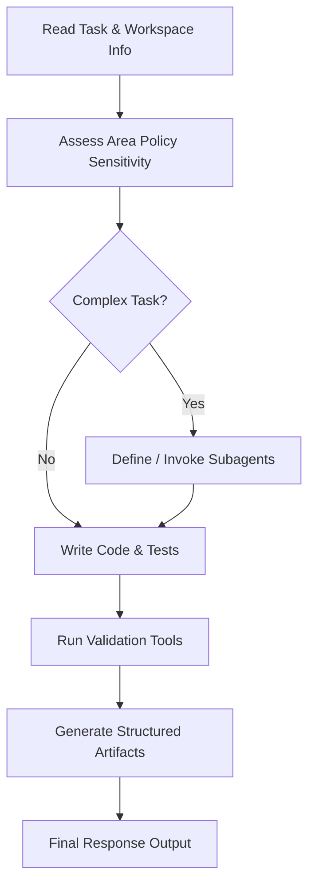

# AGENTS.md (Gemini Profile)

## 1. Authority, Scope, and Tool Usage

This file defines project-specific instructions for the Antigravity AI coding agent. It applies to all files under this workspace. 

### Core Tool Constraints
* **Precision Code Edits:** Use `replace_file_content` for single contiguous modifications and `multi_replace_file_content` for multiple non-contiguous edits. Avoid overwriting entire files using `write_to_file` unless creating a new file.
* **Lint Integration:** When modifying code to resolve lints, specify the appropriate rules using the `TargetLintErrorIds` parameter.
* **Shell Command Execution:** Run scripts and commands using `run_command`. Do NOT run `cd` commands. For long-running commands, let them run in the background; do NOT poll their status in a loop.
* **Workspace Links:** Always create clickable links for files and code symbols (classes, structs, functions) using the standard `file://` scheme (e.g., `[filename](file:///path/to/file)`).

---

## 2. Non-Negotiable Controls

> [!IMPORTANT]
> **Production Safety Guards**
> * **No Hardcoding:** Do not introduce hardcoded environment variables, hostnames, credentials, ports, or model names. Use configuration files or environment inputs.
> * **Preserve Contracts:** Do not change public APIs, serialized formats, database schemas, or CLI specifications without a Compatibility Change Record (CCR).
> * **No Test Erasure:** Do not remove tests, lower coverage thresholds, or bypass validation steps to force a build to pass.
> * **Sensitive Data Boundary:** Never expose private API keys, customer tokens, credentials, or private configuration values in code repositories, logs, or prompt histories.

---

## 3. Agent & Subagent Workflow



1. **Information Gathering:** Locate the project root, parse this `AGENTS.md` file, and identify local constraints.
2. **Subagent Delegation:** For parallelizable or highly specialized tasks (e.g., extensive research, separate database setup, test-suite runs), define a specialized subagent using `define_subagent` and invoke it via `invoke_subagent`.
3. **Execution & Editing:** Implement modifications using local target replacement tools. Maintain clean docstrings and comments.
4. **Validation:** Execute the workspace test suites using `run_command`. If commands are unavailable, state the reason and associated risks.
5. **Artifact Output:** Save extensive reports, ADRs, or compatibility records as structured Markdown files within the user's workspace or artifact directories.

---

## 4. Protected Areas & Stop Conditions

Stop and ask the user for advice or permission when encountering the following scenarios:

* **Protected Files:** Changes to CI/CD workflows, build tools (e.g., `package.json`, `cabal.project`, `setup.py`), or security controls.
* **Security & Authentication:** Modifications to auth, cryptographical operations, sandboxing, or logging redaction.
* **Insufficient Permissions:** When hitting sandbox boundaries or permission blocks, use `ask_permission` with the narrowest scope possible.
* **Design Ambiguity:** If requirements conflict or need clarification, use `ask_question` with structured options.

---

## 5. Build, Test, and Validation Environments

Validate changes using workstation-specific commands. Execute using `run_command` in the workspace root:

| Tech Stack | Formatting / Linting | Test / Run Command |
| :--- | :--- | :--- |
| **Python** | `ruff check .` \| `mypy src tests` | `python -m pytest` |
| **Haskell** | `cabal build --ghc-options="-Wall"` | `cabal test all` |
| **C / C++** | `clang-tidy -p build <changed-files>` | `ctest --test-dir build` |
| **Erlang** | `rebar3 dialyzer` | `rebar3 eunit` \| `rebar3 ct` |

---

## 6. Artifact & Reporting Guidelines

For detailed outputs (e.g., ADRs, compatibility records, migration guidelines):
* Save them as `.md` documents in the artifact folder: `/home/gentoo/.gemini/antigravity-cli/brain/161ff419-93d6-487f-b202-67f31a88ca87/` (or project root when user-facing).
* Use GitHub-style markdown features:
  * **Alerts:** `> [!NOTE]`, `> [!TIP]`, `> [!WARNING]`, etc.
  * **Interactive Carousels:** For comparing alternatives, before/after designs, or file sequences.
  * **Tables and Diagrams:** Standard markdown tables and Mermaid flowcharts.

---

## 7. Required Final Response Format

Every task completion must conclude with the following response template:

```markdown
## Summary
- **Changes:** <brief description of changes>
- **Objective:** <why changes were made>

## Files Modified
- [filename](file:///path/to/file): <purpose of change>

## Validation Execution
- `command`: **PASS** | **FAIL** | **NOT RUN** (<reason>)

## Impact & Risk Assessment
* **API/ABI Changes:** None | Yes (Link to CCR/ADR Artifact)
* **Configuration Drift:** None | Yes (Link to schema/test updates)
* **Security Boundary:** None | Review Required
* **Known Risks:** <describe risks or "None known">
```
